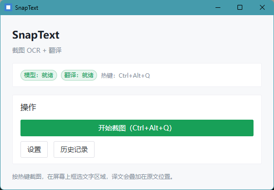
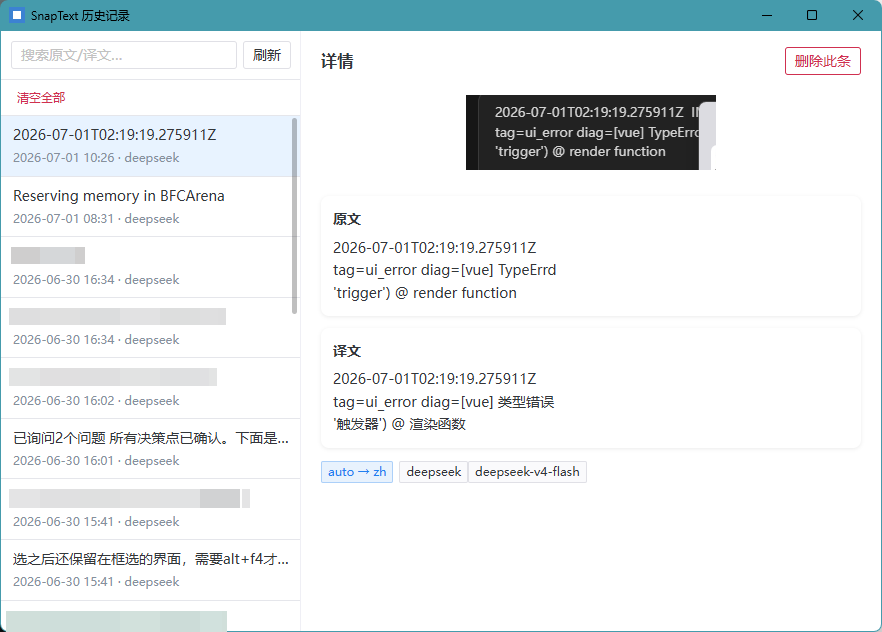
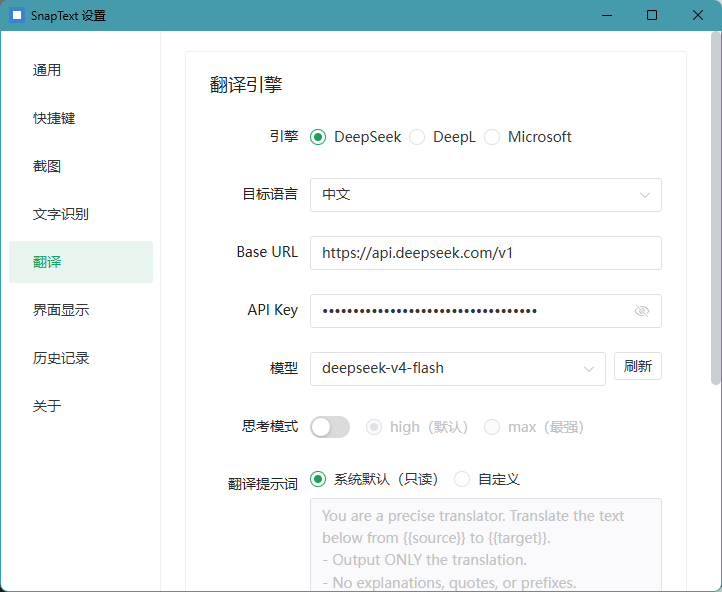

<div align="center">

# SnapText

**截图 OCR + 翻译 · 本地优先 · 快捷键驱动 · PaddleOCR PP-OCRv6**

框选屏幕区域 → 本地 OCR 识别 → 调用翻译 API → 译文图上原位覆盖

[](https://github.com/chiihero/SnapText/releases/latest)
[](LICENSE)
[](https://rustup.rs)
[](https://tauri.app)
[](https://github.com/chiihero/SnapText/releases/latest)

### 👇 [下载最新版](https://github.com/chiihero/SnapText/releases/latest)

*`SnapText_x.x.x_x64-setup.exe` · Windows 安装包*

</div>

---

## 📸 界面预览

<div align="center">
<table>
<tr>
<td align="center"><b>主界面</b></td>
<td align="center"><b>历史记录</b></td>
<td align="center"><b>设置</b></td>
</tr>
<tr>
<td></td>
<td></td>
<td></td>
</tr>
<tr>
<td align="center"><sub>深色紧凑窗口<br>快捷键键帽 + 立即截图</sub></td>
<td align="center"><sub>卡片列表<br>原文 / 译文 / 时间 / 缩略图</sub></td>
<td align="center"><sub>热键 / OCR / 翻译 / UI<br>可视化配置</sub></td>
</tr>
</table>
</div>

## ✨ 功能特性

- ⌨️ **快捷键驱动** — 默认 `Ctrl+Alt+Q` 一键触发截图，全程不离开键盘
- 🔒 **本地 OCR** — PaddleOCR 最新一代 **PP-OCRv6**（ONNX 推理）。官方 benchmark：检测 Hmean **86.2%** / 识别 **83.2%**，较上代 PP-OCRv5 提升 **+4.6% / +5.1%**；单模型覆盖 50 种语言，对屏幕文字与中英混排识别准确。离线运行，数据不出本机
- 🌐 **多翻译后端** — DeepL / DeepSeek / Microsoft，OpenAI 兼容协议
- 📝 **译文原位覆盖** — 识别后译文直接叠加回原图选区，所见即所得
- 🗂️ **历史记录** — SQLite 本地存储，按原图 / 译文 / 时间检索过往翻译
- ⚙️ **可视化配置** — 引导页 + 设置面板，热键 / Provider / OCR 档位 / UI 细节均可调
- 🎈 **便携模式** — OCR 模型跟程序走（安装目录 `models/`），便于检查与分发

## 🚀 使用流程

```
┌─────────────┐    ┌─────────────┐    ┌─────────────┐    ┌─────────────┐
│  按 Ctrl+   │ ->│  鼠标框选   │ -> │  本地 OCR   │ -> │  译文原位   │
│  Alt+Q      │    │  屏幕区域   │    │  识别文字   │    │  覆盖展示   │
└─────────────┘    └─────────────┘    └─────────────┘    └─────────────┘
```

> 译文同时写入历史记录，可随时回看与复制。

## 🛠️ 技术栈

- **后端**：Rust（Tauri 2 workspace）
  - `crates/snaptext-core`：纯逻辑库（OCR / 翻译 / 历史 / 模型管理 / 截图）
  - `src-tauri`：Tauri 二进制（系统集成 + 命令层）
- **前端**：Vue 3 + TypeScript + Naive UI + Vite
- **OCR**：PaddleOCR PP-OCRv6（本地 ONNX 推理，离线）
- **翻译**：DeepL / Microsoft / OpenAI 兼容（DeepSeek 等）

## 📦 快速开始

### 环境要求

- [Node.js](https://nodejs.org) · [Rust](https://rustup.rs)（见 `rust-toolchain.toml`）· Windows

### 开发运行

双击 `scripts/dev.bat`，或手动：

```bash
npm install
npm run tauri dev
```

首次启动会进入引导页配置快捷键、下载 OCR 模型、设置翻译 Provider。

### 打包

```bash
npm run tauri build        # 或双击 scripts/build.bat
```

安装包输出到 `src-tauri/target/release/bundle/`（NSIS）。


### 其他脚本

| 脚本 | 用途 |
|---|---|
| `scripts/reset-onboarding.bat` | 重置引导标志（保留 Key / 模型，让引导页重显） |
| `scripts/download-models.ps1` | 离线下载 OCR 模型（辅助） |
| `scripts/stress-test.ps1` | 稳定性压测 |

## 📁 项目结构

```
crates/snaptext-core/   纯逻辑库（OCR / 翻译 / 历史 / 截图 / 模型管理）
src-tauri/              Tauri 后端（命令层 + 窗口 + 状态）
src/                    Vue 前端（views / stores / styles）
scripts/                开发与打包脚本
docs/                   设计文档（CODE_MAP / DESIGN / TASKS / PROGRESS / RELEASE）
```

> 三个核心目录名分别绑定 Vite（`src/`）、Tauri CLI（`src-tauri/`）、Cargo workspace（`crates/`）的约定，非项目自定义；命名溯源见 [`docs/CODE_MAP.md`](docs/CODE_MAP.md) §顶层结构。

## 📚 文档

- [`docs/CODE_MAP.md`](docs/CODE_MAP.md) — 文件路径 ↔ 职责 ↔ 依赖映射
- [`docs/DESIGN.md`](docs/DESIGN.md) — 核模块设计与技术选型
- [`docs/RELEASE.md`](docs/RELEASE.md) — 发布到 GitHub Release 操作手册
- [`AGENTS.md`](AGENTS.md) — 开发规范

## 🔗 参考

- [PaddlePaddle / PaddleOCR](https://github.com/PaddlePaddle/PaddleOCR) — OCR 引擎上游
- [PP-OCRv6 官方文档与 benchmark](https://paddlepaddle.github.io/PaddleOCR/main/version3.x/algorithm/PP-OCRv6/PP-OCRv6.html)
- [PP-OCRv6 技术报告（arXiv）](https://arxiv.org/html/2606.13108v1)
- [PP-OCRv6_medium_rec_onnx（ModelScope）](https://www.modelscope.cn/models/PaddlePaddle/PP-OCRv6_medium_rec_onnx/summary)

## License

MIT
